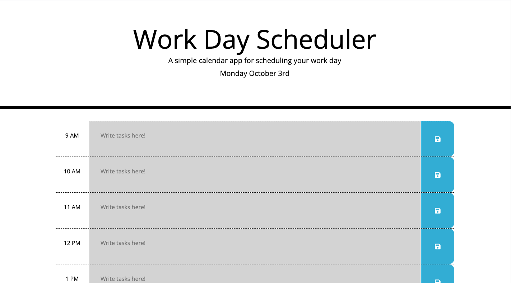
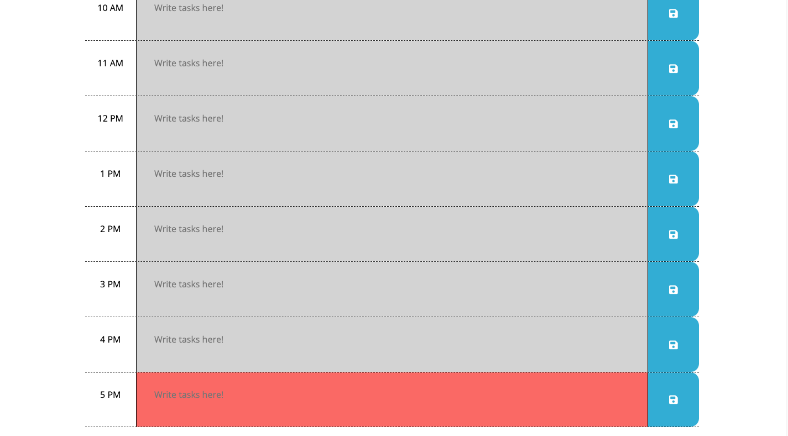
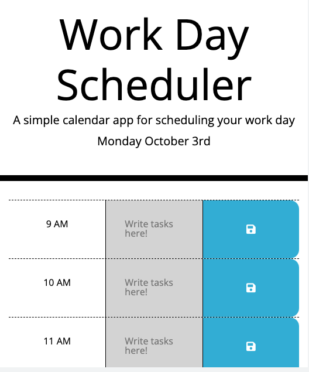

# 05 Third-Party APIs: Work Day Scheduler

## Details

This web app was created to save locally a work-day schedule. It is designed to write text in the text-area elements and then the user can save the input to local storage by hitting the "save" submit button. Skills and techniques utilized in this project include: 

- Utilizing third-party-apis (JQuery, Bootstrap, and Moment.js)
- Using the CSS framework (Bootstrap) to create the layout and provide basic CSS styling
- Using the CSS framework (Bootstrap) to make the layout responsive
- Using Moment.js to reference the current date and current time in the JavaScript files
- Using JQuery to accuarately and concisely select elements from the HTML file
- Correctly calling event listeners to call a callback function
- Creating functions to store user input data locally

## Challenges

Some of the challenges that were particularly tricky in this project were:

- Finding the right Bootstrap classes to make the containers fit correctly and look aesthetically pleasing
- Finding a way to associate specific text-area elements with its corresponding submit button
- Recalling the correct stored key value pair and inputing it into the correct text-area field

## Utilization

Select one of the text-fields and write a task to be saved. Fields in green indicate a future time, fields in grey the past, and the field in red indicates the present. Hit the 'save' button on the side to save that particular input to the browser.

## Deployment

Deployed Website:
